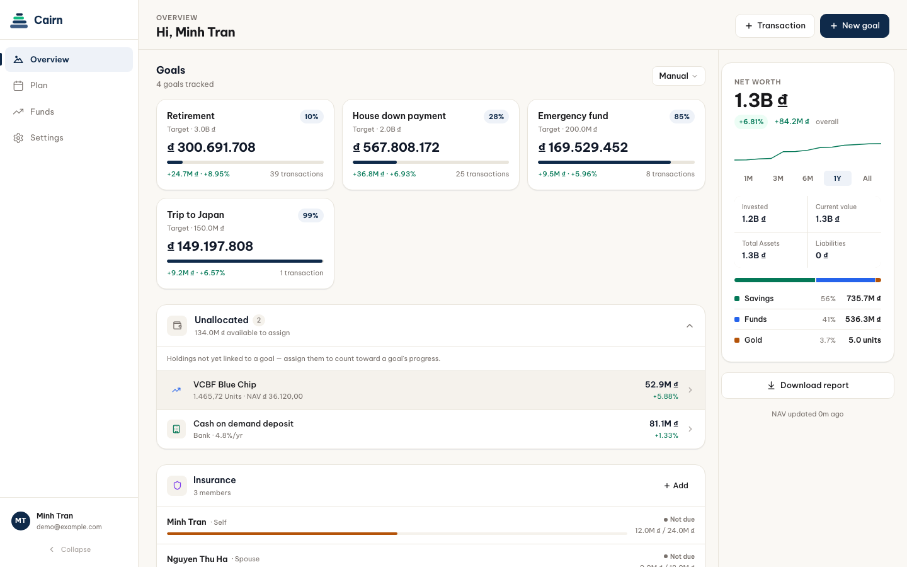

<picture>
  <source media="(prefers-color-scheme: dark)" srcset="public/cairn-wordmark-dark.svg">
  
</picture>

### Personal finance, one stone at a time.

Cairn brings your goals, investments, monthly plans, and insurance together in one clear view.

**[Try Cairn →](https://cairn-money.vercel.app/)**

Available in Vietnamese and English.

---

## See where your money is going

Cairn is a personal finance app that helps you understand what you own, what you are saving for, and how today's decisions affect your longer-term goals.

Instead of managing separate notes and spreadsheets, you can see your financial journey in one place.

## What you can do

- **See your net worth at a glance** across funds, bank deposits, gold, and stocks.
- **Create financial goals** and track how each investment moves you closer to them.
- **Plan each month** with income, fixed expenses, insurance, investments, and recurring savings.
- **Track investments** including purchases, withdrawals, interest, maturity dates, and current values.
- **Manage insurance plans** for yourself and your family, with payment and savings progress.
- **Review your portfolio over time** through allocation breakdowns and net-worth history.
- **Export a portfolio report** when you need a shareable snapshot.

## How it works

1. Create an account and choose your preferred language.
2. Add your current investments, savings goals, and insurance plans.
3. Build a monthly plan for how you want to use your income.
4. Return to the overview to follow your progress and record new activity.

## Designed for everyday use

Cairn works on desktop and mobile, supports light and dark themes, and can be installed as an app on supported devices.

Your finances may be complex. The view of them should not be.

**[Open Cairn](https://cairn-money.vercel.app/)**

